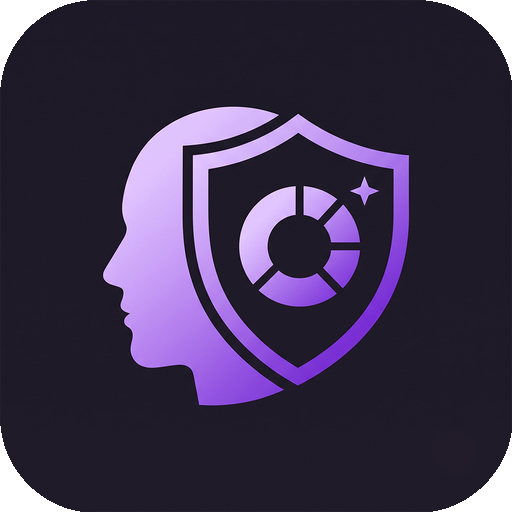

<p align="center">
  
</p>

<h1 align="center">Megrim: Migraine Log</h1>

<p align="center">
  <strong>Offline Migraine Log</strong><br>
  Smart migraine tracking that stays on your device.
</p>

**Megrim** is a privacy-first, offline-first migraine diary for Android. It automatically
enriches each logged migraine with weather, barometric-pressure, and astronomical context —
computed and stored **entirely on your device** — and surfaces personal descriptive analytics
plus odds-ratio "suspected factors" correlations.

- **No accounts, no server, no telemetry.** The app's only network traffic is to
  [Open-Meteo](https://open-meteo.com) to fetch weather for the approximate (~1 km rounded)
  location and date of entries you create.
- **Your data stays yours.** On-device SQLite only; full export/import (JSON + CSV).
- **Free and open source** (GPL-3.0-or-later), built for F-Droid.

> *"Megrim"* is an archaic English word literally meaning *migraine*.

## Status

**`v0.1.0`** — first signed release (pre-release, dogfood phase). App id `org.maegley.megrim`.
Built against [`docs/SPEC.md`](docs/SPEC.md); see that document (§12) for the full product
definition and running implementation status.

Since `v0.1.0`, a review backlog has been closed on `main` ([`docs/BACKLOG.md`](docs/BACKLOG.md)):
**light/dark theme** following the system setting, a **Medications** section in Event Detail, a more
visual **Analytics** tab (stat tiles + odds-ratio bars + labelled/shaded charts), **Ko-fi
donations**, and a fix for the Source-code/Donate links on Android 11+. An F-Droid `fdroiddata`
recipe + store screenshots are **prepared** in [`fdroid/`](fdroid/), held for the `v1.0.0` debut.

**Next milestones:** finish dogfooding → cut `v1.0.0` → open the F-Droid `fdroiddata` MR.

## Installing

Megrim is distributed outside the big app stores, in keeping with its privacy-first, FOSS goals.
Pick whichever suits you:

- **Direct APK (available now).** Download the signed `app-release.apk` from the
  [Releases page](https://github.com/smaegley/megrim/releases) and install it. You may need to allow
  installing from your browser/file manager. Releases are signed with the maintainer's key.
- **Obtainium (recommended for auto-updates).** [Obtainium](https://github.com/ImranR98/Obtainium)
  installs and **auto-updates** apps straight from their GitHub releases. Add
  `https://github.com/smaegley/megrim` as an app in Obtainium and it will track new releases for you
  — Play-store-style updates, no account or store required. **While Megrim is in its pre-release
  (dogfood) phase, turn on _Include prereleases_ for it in Obtainium** so it picks up `v0.1.0`; once
  `v1.0.0` ships as a stable release this is no longer needed.
- **F-Droid (planned).** An [`fdroiddata`](https://gitlab.com/fdroid/fdroiddata) build recipe is
  prepared (see [`fdroid/`](fdroid/)); the submission is held for the `v1.0.0` release. Once merged,
  Megrim will be installable and auto-updating through the F-Droid client. Note that the F-Droid
  build is signed with F-Droid's key, so it has a different signature than the GitHub-release APK —
  install from one source and stick with it.

There is no Google Play listing (and it isn't required — the options above cover installation and
automatic updates).

## Repository layout

```
app/       Flutter application (single codebase, Android target)
docs/      SPEC.md, PRIVACY.md, screenshots
fastlane/  F-Droid / Play listing metadata
fdroid/    F-Droid build recipe + submission notes
.github/   CI workflow, funding
```

## Building

Requires the Flutter SDK (3.44+) and the Android SDK (API 36).

```bash
cd app
flutter pub get
dart run build_runner build --delete-conflicting-outputs   # generates Drift code
flutter analyze
flutter test
flutter build apk --release
```

## Privacy

See [`docs/PRIVACY.md`](docs/PRIVACY.md). Short version: all data stays on your device; we operate
no servers and collect nothing.

## Medical disclaimer

Megrim is a personal diary and is **not a medical device**. It does not diagnose, treat, cure, or
prevent any condition. "Suspected factors" are statistical associations in *your own log* —
association is not causation. Always consult a qualified healthcare professional about your
migraines and before making any treatment decisions.

## Contributing

This is a hobby project with no SLA — see [`CONTRIBUTING.md`](CONTRIBUTING.md).

## License

[GPL-3.0-or-later](LICENSE). Weather data by [Open-Meteo.com](https://open-meteo.com) (CC-BY 4.0).
