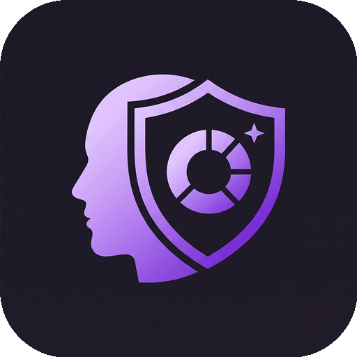

<p align="center">
  
</p>

<h1 align="center">Megrim: Migraine Log</h1>

<p align="center">
  <strong>Offline Migraine Log</strong><br>
  Smart migraine tracking that stays on your device.
</p>

**Megrim** is a privacy-first, offline-first migraine diary for **Android and iOS**. It
automatically enriches each logged migraine with weather, barometric-pressure, and astronomical
context — computed and stored **entirely on your device** — and surfaces personal descriptive
analytics plus odds-ratio "suspected factors" correlations.

- **No accounts, no server, no telemetry.** By default the app makes no automatic network
  requests (the only exception is the place-name search you type when setting your home
  location). Weather enrichment is **opt-in**; when enabled, the only network traffic is to
  [Open-Meteo](https://open-meteo.com) to fetch weather for the approximate (~1 km rounded)
  location and date of entries you create.
- **Your data stays yours.** On-device SQLite only; full export/import (JSON + CSV). The
  import format is [documented](docs/IMPORT.md) (with a [JSON Schema](docs/megrim-export.schema.json))
  so you can migrate history in from any other tracker.
- **Free and open source** (GPL-3.0-or-later), built for F-Droid.

> *"Megrim"* is an archaic English word literally meaning *migraine*.

## Status

**`v1.0.4`** — latest stable release. App id `org.maegley.megrim`.
Built against [`docs/SPEC.md`](docs/SPEC.md); see that document (§12) for the full product
definition and running implementation status.

`v1.0.0` capped the 0.x series (one-tap logging, offline enrichment, on-device analytics with
suspected-factor correlations, light/dark theme, Medications, tap-to-edit History Calendar,
JSON/CSV export) with an **accessibility pass** (tap-target sizes, WCAG text contrast,
screen-reader labels, verified by automated guideline tests in both themes) and a **fully
documented import format** ([`docs/IMPORT.md`](docs/IMPORT.md) +
[JSON Schema](docs/megrim-export.schema.json)) for migrating history from any other tracker.

`v1.0.1` makes **weather enrichment opt-in** (default off — arising from the F-Droid inclusion
review), tags weather-dependent charts with *why* they're blank when it's off, adds **offline
home-location entry** (type GPS coordinates or a Plus Code; nothing sent online), and **removes
the unused location permissions** — the app now declares only `INTERNET` and never reads device
location. *Upgrading users: enrichment starts off; enable it in Settings › Weather enrichment to
resume weather lookups and backfill past entries.*

`v1.0.4` is the first release with community contributions. Entries now remember the time zone
they were logged in, so travelling no longer shifts them to another day in Analytics or History
([#17](https://github.com/smaegley/megrim/issues/17)); editing a start time moves the end with it
([#14](https://github.com/smaegley/megrim/pull/14), zatteo); JSON exports carry the app's computed
analytics ([#16](https://github.com/smaegley/megrim/issues/16)); and a new offline report page,
[`tools/report.html`](tools/report.html), turns an export into a printable summary or PDF
([#11](https://github.com/smaegley/megrim/pull/11), nfd9001 — see [`docs/REPORT.md`](docs/REPORT.md)).

**Accepted into F-Droid** — [!43692](https://gitlab.com/fdroid/fdroiddata/-/merge_requests/43692)
merged 2026-08-23. **Live on the Apple App Store** —
[Megrim: Migraine Diary](https://apps.apple.com/us/app/megrim-migraine-diary/id6808385548),
approved 2026-09 (US storefront). For a resume-here snapshot of the project — what is shipped,
what is in flight, known gaps — see [`docs/STATUS.md`](docs/STATUS.md).

## Installing

### iPhone (iOS 16+)

**[Megrim: Migraine Diary on the App Store](https://apps.apple.com/us/app/megrim-migraine-diary/id6808385548)**
— released 2026-09. Currently on the United States storefront. Same app, same on-device-only
data model as the Android builds.

### Android

Megrim for Android is distributed outside Google Play, in keeping with its privacy-first, FOSS
goals. Pick whichever suits you:

- **Direct APK (available now).** Download the signed `app-release.apk` from the
  [Releases page](https://github.com/smaegley/megrim/releases) and install it. You may need to allow
  installing from your browser/file manager. Releases are signed with the maintainer's key.
- **Obtainium (recommended for auto-updates).** [Obtainium](https://github.com/ImranR98/Obtainium)
  installs and **auto-updates** apps straight from their GitHub releases. Add
  `https://github.com/smaegley/megrim` as an app in Obtainium and it will track new releases for you
  — Play-store-style updates, no account or store required.
- **F-Droid.** The [`fdroiddata`](https://gitlab.com/fdroid/fdroiddata) build
  **recipe was merged on 2026-08-23**, so Megrim is in the F-Droid catalogue and new `v*` tags
  are picked up automatically. Note that the F-Droid build is signed with F-Droid's key, so it
  has a different signature than the GitHub-release APK — install from one source and stick with
  it.

There is no Google Play listing (and it isn't required — the options above cover installation and
automatic updates).

## Repository layout

```
app/       Flutter application (single codebase, Android target)
docs/      STATUS.md (start here), SPEC.md, PRIVACY.md, IMPORT.md, REPORT.md
tools/     offline export→report webapp (report.html), sample data + converter scripts
fastlane/  F-Droid / Play listing metadata
fdroid/    F-Droid build recipe + submission notes
.github/   CI workflow, funding
```

## Building

Requires the Flutter SDK (3.44+) and the Android SDK (API 36).

```bash
cd app
flutter pub get
dart run build_runner build --delete-conflicting-outputs   # generates Drift code
flutter analyze
flutter test
flutter build apk --release
```

Debug builds (`flutter run`, `flutter build apk --debug`) use the application id
`org.maegley.megrim.debug` and the launcher name **Megrim dev**, so they install beside the
store/F-Droid app with their own data instead of replacing it.

## Privacy

See [`docs/PRIVACY.md`](docs/PRIVACY.md). Short version: all data stays on your device; we operate
no servers and collect nothing.

## How the analytics work

See [`docs/METHODS.md`](docs/METHODS.md) for a plain-language explanation of every number on the
Analytics tab — what an odds ratio means here, exactly how "Top Suspected Factors" is computed
(2×2 contingency per factor with a Haldane–Anscombe correction), which thresholds gate what gets
shown, and the limits of what the analysis can tell you.

## Medical disclaimer

Megrim is a personal diary and is **not a medical device**. It does not diagnose, treat, cure, or
prevent any condition. "Suspected factors" are statistical associations in *your own log* —
association is not causation. Always consult a qualified healthcare professional about your
migraines and before making any treatment decisions.

## Contributing

This is a hobby project with no SLA — see [`CONTRIBUTING.md`](CONTRIBUTING.md).

## License

[GPL-3.0-or-later](LICENSE). Weather data by [Open-Meteo.com](https://open-meteo.com) (CC-BY 4.0).
