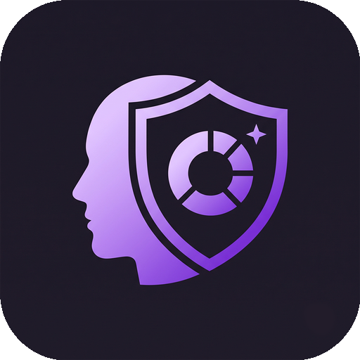

<p align="center">
  
</p>

<h1 align="center">Megrim: Migraine Log</h1>

<p align="center">
  <strong>Offline Migraine Log</strong><br>
  Smart migraine tracking that stays on your device.
</p>

**Megrim** is a privacy-first, offline-first migraine diary for **Android and iOS**. It
automatically enriches each logged migraine with calendar, astronomical and (if you opt in)
weather and barometric-pressure context, computed and stored **entirely on your device**, and
turns your log into personal analytics: how often migraines happen, and which conditions tend to
come before them.

- **No accounts, no server, no telemetry.** By default the app makes no automatic network
  requests (the only exception is the place-name search you type when setting your home
  location). Weather enrichment is **opt-in**; when enabled, the only network traffic is to
  [Open-Meteo](https://open-meteo.com) to fetch weather for the approximate (~1 km rounded)
  location and date of entries you create.
- **Your data stays yours.** On-device SQLite only; full export and import (JSON and CSV). The
  import format is [documented](docs/IMPORT.md) (with a [JSON Schema](docs/megrim-export.schema.json))
  so you can bring history in from any other tracker.
- **Free and open source** (GPL-3.0-or-later), built for F-Droid.

> *"Megrim"* is an archaic English word literally meaning *migraine*.

## Features

**Logging**
- **One tap to start a migraine**, one to end it; an elapsed timer, severity slider and notes
  while it's going, and **Discard** for an accidental tap. Or long-press the app icon and choose
  **Log migraine**.
- Full entry details: start and end (in the time zone you logged in), severity, head location,
  aura, medications with dose and whether each helped, suspected triggers (including "Travel"),
  sleep, stress, notable foods, notes, and the recorded location (your home, a recent place, a
  search, GPS coordinates or a Plus Code; never read from the device's GPS).
- **Add past entries** from History, including migraines that ran over several days.
- Editable lists of triggers, head locations and medications.

**History**
- A list view and a weekday-aligned **calendar**, coloured by severity; multi-day migraines show
  on every day they cover. Tap any day to open or add an entry.

**Analytics** (all computed on the device; see [`docs/METHODS.md`](docs/METHODS.md))
- **Days since your last migraine**, coloured against your usual gap, and a summary (entries,
  years tracked, average severity, duration, interval, migraines per year).
- **Migraine days per month**: the last 30 days, the average over the last 3 complete months, and
  a bar for every month since your first entry, the measure neurologists use to judge frequency
  and treatment.
- **Top Suspected Factors**: odds ratios for day of week, month, season, moon phase, daylight
  hours and (with weather on) pressure change, with the caveats spelled out.
- Descriptive charts by year, weekday, season, time of day, daylight, pressure change and moon
  phase; the most-tagged triggers; and an **Away from home** share.

**Reports, export and backup**
- **Export report (PDF)**: a printable summary for a clinician, built on the device.
- Export to JSON (a full backup, including the computed analytics) or CSV; import JSON (merge or
  replace). Your phone's own backup (Google on Android, iCloud or a computer on iPhone) includes
  the diary too.
- An optional **backup reminder** that shows when you last exported and can warn you after an
  interval you choose.

**Privacy and accessibility**
- Optional **app lock** (Settings › Privacy) with your phone's own fingerprint, face or PIN, so
  there's no separate Megrim PIN to forget; it locks again after a time you choose. **Hide in
  recent apps** blanks Megrim in the app switcher (on Android it also blocks screenshots).
- Light and dark themes following the phone; tap targets, contrast and screen-reader labels
  checked by automated tests in both themes.

## Status

**Latest release: [`v1.0.7`](https://github.com/smaegley/megrim/releases/tag/v1.0.7)**
(2026-10-08). App id `org.maegley.megrim`.

- **F-Droid:** in the catalogue since 2026-08-23
  ([!43692](https://gitlab.com/fdroid/fdroiddata/-/merge_requests/43692)); new `v*` tags are
  picked up automatically.
- **Apple App Store:** live since 2026-09 as
  [Megrim: Migraine Diary](https://apps.apple.com/us/app/megrim-migraine-diary/id6808385548)
  (US storefront).
- **GitHub releases:** signed APKs on the [Releases page](https://github.com/smaegley/megrim/releases).

For a resume-here snapshot of the project (what is shipped, in flight, and known gaps), see
[`docs/STATUS.md`](docs/STATUS.md). The product definition is [`docs/SPEC.md`](docs/SPEC.md), and
planned and proposed work is in [`docs/BACKLOG.md`](docs/BACKLOG.md).

## Release history

Newest first. Full notes for each release are on the
[Releases page](https://github.com/smaegley/megrim/releases).

- **`v1.0.7`** (2026-10-08): **app lock** with the phone's own fingerprint, face or PIN, and
  **Hide in recent apps** (on Android this adds the `USE_BIOMETRIC` and `USE_FINGERPRINT`
  permissions, granted at install with no prompt and unused unless app lock is on); **migraine
  days per month** on Analytics and in the PDF report; a **"Log migraine"** shortcut on the app
  icon; **Android backup now includes the diary** (before, Android 12 and later backed up
  Megrim's settings but not its database); and **more accurate Suspected Factors**: each
  migraine counts once, on the day it started, the days in the middle of a multi-day migraine
  are left out of the comparison, and pressure is measured the same way on migraine days and
  other days, so odds ratios will change (pressure ones most). See
  [`docs/METHODS.md`](docs/METHODS.md).
- **`v1.0.6`** (2026-10-05): an in-app **printable report** (Settings › Export report (PDF)),
  built entirely on the device, and an optional **backup reminder** that shows when you last
  exported and warns you after an interval you choose.
- **`v1.0.5`** (2026-09-29): travel made visible. The Recorded-location picker offers your last
  three locations ([#15](https://github.com/smaegley/megrim/issues/15) /
  [#18](https://github.com/smaegley/megrim/pull/18), zatteo); Analytics gains an **Away from
  home** share (entries recorded more than 100 km from home, and where); "Travel" joins the
  default triggers.
- **`v1.0.4`** (2026-09-22), the first release with community contributions: entries remember the
  time zone they were logged in, so travelling no longer shifts them to another day
  ([#17](https://github.com/smaegley/megrim/issues/17)); editing a start time moves the end with
  it ([#14](https://github.com/smaegley/megrim/pull/14), zatteo); JSON exports carry the app's
  computed analytics ([#16](https://github.com/smaegley/megrim/issues/16)); and an offline report
  page, [`tools/report.html`](tools/report.html), turns an export into a printable summary
  ([#11](https://github.com/smaegley/megrim/pull/11), nfd9001; see [`docs/REPORT.md`](docs/REPORT.md)).
- **`v1.0.3`** (2026-09-19): fixes. The History calendar keeps your place after opening an entry
  or switching views ([#13](https://github.com/smaegley/megrim/issues/13)); backing out of a new
  past entry no longer leaves an empty entry behind
  ([#12](https://github.com/smaegley/megrim/issues/12)); returning from a Manage list no longer
  discards unsaved edits. Debug builds became a separate "Megrim dev" app.
- **`v1.0.2`** (2026-08-27): the Enrichment values on an entry are rounded ("14.8 h",
  "-6.2 hPa") instead of showing raw floating-point numbers, as reported by an F-Droid reviewer.
- **`v1.0.1`** (2026-08-04): **weather enrichment became opt-in** (off by default, from the
  F-Droid inclusion review); weather-dependent charts say why they're blank when it's off;
  **offline home-location entry** (GPS coordinates or a Plus Code, nothing sent online); and the
  unused location permissions were removed. *Upgrading users: turn on Settings › Weather
  enrichment to resume weather lookups and backfill past entries.*
- **`v1.0.0`** (2026-07-23) capped the 0.x series (one-tap logging, offline enrichment, on-device
  analytics with suspected-factor correlations, light/dark theme, medications, tap-to-edit History
  calendar, JSON/CSV export) with an **accessibility pass** and a **fully documented import
  format**.

## Installing

### iPhone (iOS 16+)

**[Megrim: Migraine Diary on the App Store](https://apps.apple.com/us/app/megrim-migraine-diary/id6808385548)**,
currently on the United States storefront. Same app, same on-device-only data model as the
Android builds.

### Android

Megrim for Android is distributed outside Google Play, in keeping with its privacy-first, FOSS
goals. Pick whichever suits you:

- **F-Droid.** Megrim is in the [F-Droid](https://f-droid.org) catalogue and updates through the
  F-Droid client.
- **Obtainium (auto-updates from GitHub).** [Obtainium](https://github.com/ImranR98/Obtainium)
  installs and **auto-updates** apps straight from their GitHub releases. Add
  `https://github.com/smaegley/megrim` as an app in Obtainium.
- **Direct APK.** Download the signed `app-release.apk` from the
  [Releases page](https://github.com/smaegley/megrim/releases) and install it. You may need to
  allow installing from your browser or file manager.

The F-Droid build is signed with F-Droid's key, and the GitHub/Obtainium APK with the
maintainer's, so Android treats them as different signers: **install from one source and stick
with it** (switching means exporting, uninstalling, reinstalling and importing). There is no
Google Play listing.

## Repository layout

```
app/       Flutter application (single codebase: Android and iOS)
docs/      STATUS.md (start here), SPEC.md, BACKLOG.md, METHODS.md, PRIVACY.md, IMPORT.md,
           REPORT.md, APP_STORE.md, release-notes/
tools/     offline export→report page (report.html), sample-data, test-dataset, icon and
           changelog scripts, and a converter from another tracker's export
fastlane/  store listing metadata (F-Droid reads it; per-version changelogs are generated)
fdroid/    F-Droid build recipe and submission notes
.github/   CI workflow, funding
```

## Building

Requires the Flutter SDK (3.44+). For Android, the Android SDK (API 36) and JDK 17; for iOS, a
Mac with Xcode.

```bash
cd app
flutter pub get
dart run build_runner build --delete-conflicting-outputs   # only after schema changes; the Drift code is committed
flutter analyze
flutter test
flutter build apk --release        # Android
flutter build ios --release        # iOS (on a Mac)
```

Debug builds (`flutter run`, `flutter build apk --debug`) use the application id
`org.maegley.megrim.debug` and the launcher name **Megrim dev**, so on Android they install
beside the store or F-Droid app with their own data instead of replacing it.

Store screenshots are generated: `tools/screenshots.sh <target>` (e.g. `iphone-69`, `ipad-13`,
`android-phone`) runs the app on a Simulator or emulator with made-up sample data, captures the
shot list in `app/integration_test/shots.dart`, checks each image's size and files it for the
store. `tools/screenshots.py --list` shows the targets.

Release notes are written once per version in `docs/release-notes/<version>.txt` (500 characters
at most, for F-Droid); `tools/sync_changelogs.py` generates F-Droid's per-ABI changelog files
from them, and CI checks they're in step.

## Privacy

See [`docs/PRIVACY.md`](docs/PRIVACY.md). Short version: all data stays on your device; we
operate no servers and collect nothing. The Android app's permissions are `INTERNET` (weather and
place search, only when you use them), the network-state check used to detect being offline, and
`USE_BIOMETRIC` / `USE_FINGERPRINT` for the optional app lock. There is no location permission.

## How the analytics work

See [`docs/METHODS.md`](docs/METHODS.md) for a plain-language explanation of every number on the
Analytics tab: what an odds ratio means here, exactly how Top Suspected Factors is computed (a
2×2 table per factor with a Haldane–Anscombe correction, counting the day each migraine started),
how migraine days per month are counted, which thresholds decide what is shown, and the limits of
what the analysis can tell you.

## Medical disclaimer

Megrim is a personal diary and is **not a medical device**. It does not diagnose, treat, cure, or
prevent any condition. "Suspected factors" are statistical associations in *your own log*;
association is not causation. Always consult a qualified healthcare professional about your
migraines and before making any treatment decisions.

## Contributing

This is a hobby project with no SLA; see [`CONTRIBUTING.md`](CONTRIBUTING.md).

## License

[GPL-3.0-or-later](LICENSE). Weather data by [Open-Meteo.com](https://open-meteo.com) (CC-BY 4.0).
